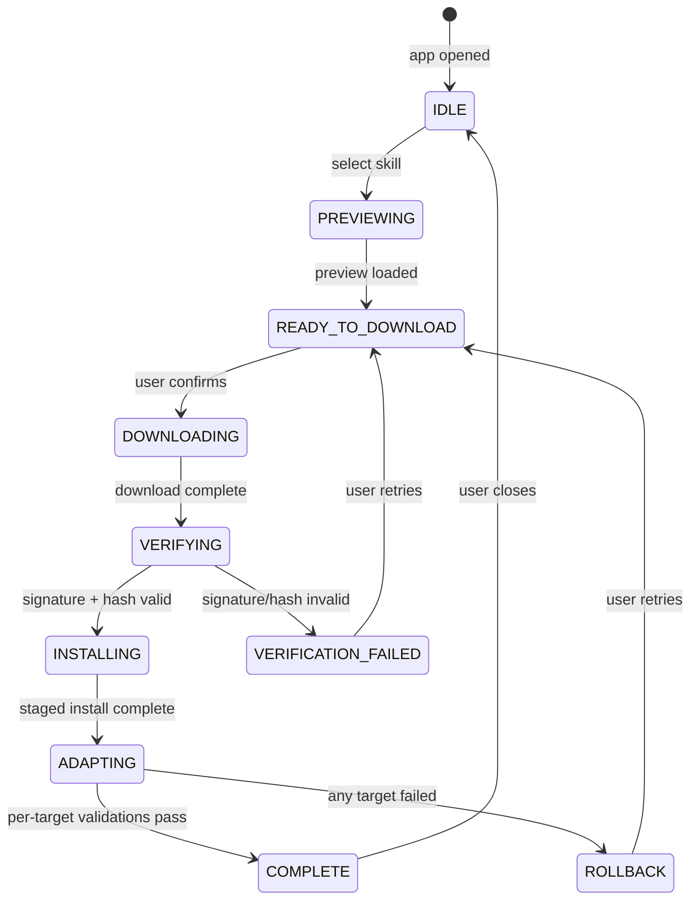

# Trustworthy Skills Inspector — Technical Specification

## 1) Executive Summary
This technical specification defines the architecture, data contracts, security model, and delivery plan for a macOS Skills Inspector that verifies skill artifacts, enforces consentful installs, and publishes deterministic artifacts with attestations. It operationalizes the PRD requirements for cryptographic integrity, cross-IDE adapters, and audit-grade change tracking.

## 2) Architecture
- Components: TrustStore (allowlist + revocations), Preview API client (safe preview from server), ArtifactFetcher (guarded download), Verifier (hash + signature), Sanitizer (archive checks), Installer (staging + atomic move), Adapters (Codex/Claude/Copilot), Publisher (pinned tool runner + attestation), Ledger (append-only), UI (SwiftUI shell with provenance badges).

```mermaid
flowchart TD
  UI[Select skill] -->|Preview| FetchMeta[Preview API client (safe preview)]
  FetchMeta --> UI
  UI -->|Download & verify| FetchZip[ArtifactFetcher (full)]
  FetchZip --> Verifier
  Verifier -->|fail| UI
  Verifier -->|pass| Sanitizer[Archive Sanitizer]
  Sanitizer --> Installer
  Installer --> Ledger
  Installer --> Adapters[Adapters: Codex/Claude/Copilot]
  Ledger --> Changelog[Changelog exporter]
```

### Component Behavior / State Model


## 3) API Design
**Preview API (Remote Catalog):**
- `GET /skills` -> list of skills with `name`, `latestVersion`, `signerKeyId`, `previewHash`, `updatedAt`.
- Pagination: `?limit=50&cursor=...` with `nextCursor` in response; default limit 50, max 200.
- Versioning: `Accept: application/vnd.stools.skills.v1+json` and `X-API-Version: 1`.
- `GET /skills/{id}/preview` -> SKILL.md content and `previewHash` (for safe preview).
- `GET /skills/{id}/manifest` -> manifest JSON with hashes, signer, targets.
- `GET /skills/{id}/artifact` -> artifact download (requires manifest verification on client).
- `GET /keys` -> signed keyset containing signer public keys, key status (active/revoked), and `expiresAt` (root key signature).

**Error handling:**
- 400 for invalid ids, 404 for missing skills, 429 for rate limits, 5xx for server errors.
- Client retries GET with jitter on 5xx only; no retries on 4xx.
- Errors return a stable JSON shape: `{ "error": { "code": "...", "message": "...", "requestId": "..." } }`.
- Responses include `ETag` and support `If-None-Match` for preview/manifest caching.
- Optional auth: `Authorization: Bearer <token>` (if catalog is gated); unauthenticated access must be explicitly allowed.

## 4) Data Models
- **SkillManifest**: name (string), version (semver), sha256 (hex), size (int), signature (base64), signerKeyId (string), trustedSigners (array), revokedKeys (array), builtWith (object), targets (array), minAppVersion (semver).
- **LedgerEvent**: id (uuid), ts (iso8601), action (install|update|remove|verify), skillId (string), version (semver), hash (hex), signerKeyId (string), source (local|remote), result (success|failed), targets (array), perTargetResults (map), notes (string).
- **Attestation**: artifactHash (hex), tool (string), toolHash (hex), buildTimestamp (iso8601), signerKeyId (string), signature (base64).

## 5) Security Considerations
- Trust store is writable only by the current user and stored outside skill artifacts.
- All archive extraction uses path validation to prevent traversal and symlink attacks.
- Key rotation requires explicit user consent when signerKeyId changes.
- Revocation updates are fetched from the catalog and cached with expiry; keyset is signed by a root key pinned in the app.
- Network communications require HTTPS with TLS 1.2+; optional CA pinning in advanced settings.
- Changelog signing uses a per-device key stored in Keychain; exported changelogs include the public key for verification. Optional org-managed signing key is supported via configuration.

## 6) Deployment Strategy
- Roll out behind feature flags: `skillVerification`, `pinnedPublishing`, `crossIDEAdapters`, `telemetryOptIn`, `bulkActions`.
- Migrate existing installs into ledger on first launch; no behavioral change until verification is enabled.
- Kill switch: disable remote installs and updates if verification failures spike or revocation list is unavailable.
- Backward compatibility: maintain existing skill layouts on disk; new metadata stored separately.
- Catalog auth rollout: if gating is enabled, support a grace period for unauthenticated preview while install requires auth.

## 7) Functional Requirements (Implementation Details)
### Install/Update
- Require manifest containing checksum (sha256) and signer key ID; verify before unzip; fail closed.
- Support detached Ed25519 signatures; allow multiple trusted keys per skill for rotation; maintain `revokedKeys` list per skill.
- Size/MIME limits and archive structure validation (no symlinks, no absolute paths, bounded file count).
- Consent gate: API-based preview labeled “Safe preview from server”; integrity only confirmed on download + verify.
- Rollback: keep last-good version and restore automatically on failure.

### Publish
- Replace `bunx ...@latest` with pinned version plus checksum; vendor or lock via SRI; record tool hash.
- Produce deterministic zip with recorded build info (tool version, hash, timestamp).
- Emit signed attestation (in-toto style manifest) stored alongside artifact; dry-run mode supported.

### Versioning and Changelog
- Local append-only ledger (SQLite) of installs/updates/removals with version, hash, signer key, source, IDE targets, and per-target result.
- Auto-generate markdown changelog per skill from ledger entries.

### Cross-IDE Unification
- Adapter layer writes validated artifacts into:
  - Codex: existing sTools skill layout.
  - Claude Code: `~/.claude/skills/`.
  - GitHub Copilot: `~/.copilot/skills/`.
- Post-install validation hooks per target; ledger records success/failure per IDE.

### UX and Safety
- Provenance badge (verified/unknown/failing) with human-readable signer.
- Explicit “Download and verify” CTA; progress with failure reasons.
- Clear trust prompt: “Trust signer for this skill” with per-skill cache.
- Offline-friendly: cached manifests and last-known-good installs.
- Split-view navigation with a local/remote source toggle to make context explicit.
- Detail side panel for remote skills with inline SKILL.md preview, changelog, and signer provenance before download. Include a “Safe preview from server” label.
- Toolbar actions for bulk operations (Verify All, Update All Verified, Export Changelog).
- Dedicated empty states for: no local skills, no remote results, offline mode, and verification failures.
- Error language is actionable (what failed, how to retry) and never suggests that an unverified skill is safe.
- Bulk actions require confirmation with a per-skill summary and allow per-skill opt-out.
- Rollback prompts show the version being restored and the failure reason.

### UI/UX Decisions
- Default landing view is Remote; remember last selection per user and restore on launch.
- Trust prompt copy uses a two-line format: a short action header plus a single-sentence risk clarification.

### UI/UX Acceptance Checklist (for testing + snapshots)
- Split-view layout renders with local/remote toggle visible and focusable.
- Skill rows show a single primary state with the expected badge and status text.
- Consent prompt appears only on download/verify; cancel keeps current version.
- Error state copy includes: what failed, what can be retried, and a safe fallback action.
- Offline mode shows a dedicated empty state and disables download actions.
- Bulk actions show a summary with per-skill opt-out.
- Rollback dialog includes target version + failure reason.
- Snapshot coverage includes: verified, unverified, failed, updating, offline, and empty states.

### UI Copy Guide (Trust + Error States)
- Trust prompt header: “Trust signer for this skill?”\n  Body: “You are about to install code signed by {SignerName}. Verification happens before install.”\n  Secondary: “Cancel keeps the current version.”
- Verification failure: “Verification failed — signature mismatch.”\n  Guidance: “Download again or choose a different version. The current version remains installed.”
- Unverified state badge tooltip: “Unverified — not safe to run until verified.”

### Telemetry (opt-in)
- Capture counts of verified installs, blocked downloads, publish runs; include app version and anonymized install ID; no PII. Metrics are recorded only when telemetryOptIn is enabled (default off). Retain telemetry locally for 30 days.
- Telemetry payloads are allowlisted and validated before enqueueing; when opt-out, no network calls are made.

## 8) Non-Functional Requirements
- Security: OWASP Top 10:2025 A8 Software Integrity; fail-closed verification; local trust store at `~/Library/Application Support/SkillsInspector/trust.json`.
- Performance: Verify 10 MB artifact in <300 ms on M3; enforce download size cap (default 50 MB) and file-count cap (2,000 entries).
- Reliability: Atomic install (stage to temp, then move); rollback on verification or adapter failure.
- Accessibility: WCAG 2.2 AA; keyboard navigation for consent, badges, and rollback controls.
- Privacy: Telemetry off by default; when on, redact paths and user identifiers.
- Observability: structured logs include {service:"sTools", action, slug, version, targets, result, duration_ms, verification}.

## 9) Edge Cases and Mitigations
- Zip bombs/oversized archives: reject if size/file-count exceeds caps.
- MITM: enforce HTTPS + signature verification; optional CA pinning toggle.
- Key rotation: accept multiple trustedSigners per skill; TrustStore manages revocations.
- Adapter drift: per-target validation with explicit failure surfacing and rollback.
- Cache poisoning: validate cached preview against manifest hash; expire by ETag/time.

## 10) Delivery Plan (next 14 days)
1. Trust foundations: manifest schema, TrustStore, verifier, sanitizer, policy config, tests for tampered/oversized archives.
2. Consentful preview: API-based safe preview labeling; “Download and verify” gate; size/MIME limits; UX wiring.
3. Pinned publishing: vendor/lock CLI with checksum; deterministic zip; attestation output. Pin `clawdhub@0.1.0` with integrity `sha512-LZ0mRf61F5SjgprrMwgyLRqMOKxC5sQZYF1tZGgZCawiaVfb79A8cp0Fl32/JNRqiRI7TB0/EuPJPMJ4evmK0g==`.
4. Ledger + changelog: append-only log; markdown generator; rollback support.
5. Remote detail caching + preview panel: cache SKILL.md/changelog metadata to avoid repeated downloads; surface provenance badges in list + detail; cache TTL/eviction policy (7 days or 50MB).
6. Adapters MVP: write to Codex/`~/.claude/skills/`/`~/.copilot/skills/`; add validation stubs and ledger recording.
7. Telemetry stub + privacy notice; feature flag to disable.

## 11) Testing and Validation
- Unit: hash/signature verification, archive sanitization, manifest parsing, TrustStore allow/deny, ledger writes.
- Integration: end-to-end install (good/bad signatures), rollback path, publish producing deterministic hash, per-IDE adapter status.
- UX: snapshot coverage for provenance badges and consent dialogs; accessibility labels present.
- Security: Semgrep/AST checks for unsafe file operations; zip-bomb fixture test.
- Performance: verify latency <300 ms for 10 MB; download concurrency caps.

## 12) Open Questions
- Where is the authoritative signed keyset hosted, and who operates the root key?
- What is the supported, documented integration contract for Claude Code and GitHub Copilot skill directories?
- Should catalog preview/manifest require auth, and if so what is the token issuance flow?
- Which signing model should be default for changelog exports (per-device key vs org key)?

## 13) Assumptions
- Skill sources can provide manifest with hash + signature; otherwise a metadata proxy can supply it.
- Users accept opt-in telemetry; default remains off.
- Claude Code and Copilot accept a mirrored skill layout or provide a documented local skill directory.
- The catalog can provide a signed keyset or equivalent trust anchor for signer keys.

=== Debate Complete ===
Document: Technical Specification
Rounds: 3
Models: PM, UI/UX, Frontend, API, Backend, Security, Reliability/SRE, Cost/Scale
Key refinements:
- Added required technical sections and state model.
- Clarified API error handling and retry policy.
- Added key distribution endpoint, API versioning/pagination, and telemetry/auth constraints.
- Added UI/UX requirements for empty states, error clarity, and bulk confirmations.

[AGREE]
