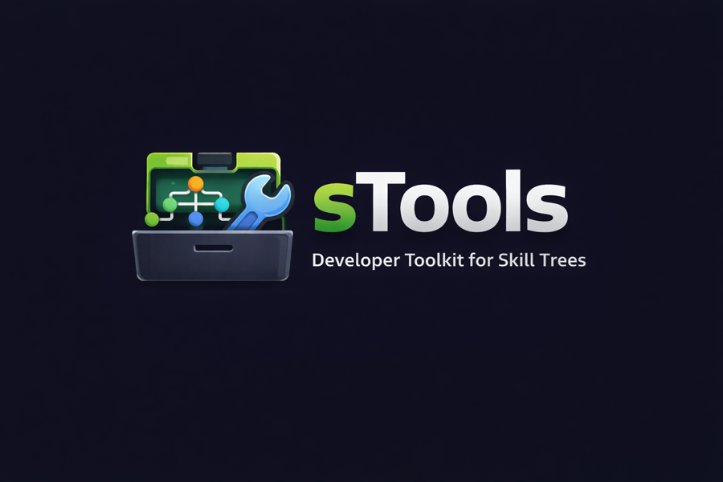

# SkillsInspector

## Developer toolkit for Codex/Claude skill trees



sTools helps you check, sync, and manage skill documentation across AI
agent platforms (Codex and Claude). It provides three ways to work with your
skills:

- **SkillsInspector app (sTools)**: Interactive macOS app for

  scanning and syncing skills

- **skillsctl CLI**: Command-line tool for CI/CD integration and scripting
- **SkillsLintPlugin**: SwiftPM plugin for automated validation in your build

  process

**Core capabilities:**

- Scan and check SKILL.md files with parallel processing
- Compare skill trees between Codex and Claude platforms
- Generate skill indexes and manage versions
- Incremental caching for fast re-validation
- Watch mode for development workflows
- Browse remote skills with safe preview and verified installs
- Cross-IDE installs for Codex, Claude, and Copilot roots
- Ledger-backed changelog exports with signatures for audit
- Pinned publishing with deterministic artifacts and attestations

## Contents

- [Prerequisites](#prerequisites)
- [Quick Start](#quick-start)
- [Glossary](#glossary)
- [Build & Test](#build--test)
- [CLI Usage](#cli-usage)
- [Shell completion](#shell-completion)
- [SwiftPM plugin (CI)](#swiftpm-plugin-ci)
- [SkillsInspector app (sTools)](#skillsinspector-app-stools-macos)
- [Configuration](#configuration)
- [Performance Features](#performance-features)
- [Troubleshooting](#troubleshooting)
- [DocC](#docc)
- [Project structure](#project-structure)
- [Verification](#verification)
- [License](#license)

## Prerequisites

- macOS 14+ SDK
- Swift 6.2 toolchain (swift-tools-version: 6.2)

## Build & Test

```bash
# Build the project
swift build

# Run tests (set ALLOW_CHARTS_SNAPSHOT=1 to include chart snapshots)
swift test

# Expected output: All tests should pass with possible chart snapshot skips
# ✓ Tests passed (X tests, Y skipped)
```

**Verify installation:**

```bash
# Check CLI is working
swift run skillsctl --help
# Expected: Help text showing available commands (scan, sync-check, etc.)

# Test basic scan (should exit cleanly on empty repo)
swift run skillsctl scan --repo . --allow-empty
# Expected: "No SKILL.md files found" message, exit code 0
```

## Quick Start

**For CLI users (recommended for CI/automation):**

```bash
# Scan skills in current repository
swift run skillsctl scan --repo .

# Expected output: List of validation findings or "No issues found"
# Exit code: 0 (success), 1 (validation errors), 2 (usage error)
```

**For GUI users:**

```bash
# Launch the SkillsInspector app
swift run SkillsInspector

# The app will open with folder pickers for Codex and Claude skill roots
# Default locations: ~/.codex/skills and ~/.claude/skills
```

**For CI integration:**

```bash
# Add to your Swift package
swift package plugin skills-lint

# Expected: Validation results as Xcode diagnostics
```

## Glossary

**Key terms used throughout sTools:**

- **Skill**: A documented capability or instruction set, stored as a SKILL.md

  file

- **Skill tree**: A directory structure containing many skills for an AI

  agent

- **Agent**: The AI platform (Codex or Claude) that uses the skills
- **Root**: The top-level directory containing a skill tree (e.g.,

  `~/.codex/skills`)

- **Validation**: Checking skills for proper format, required fields, and

  consistency

- **Sync**: Comparing skill trees between different agents to find differences
- **Baseline**: A saved list of known validation issues to ignore
- **Finding**: A validation issue discovered during scanning (error, warning,

  or info)

## CLI Usage

**Basic scanning:**

```bash
# Scan repository skills (preferred for CI)
skillsctl scan --repo . --format json

# Scan home directories with parallel validation (default excludes enabled)
skillsctl scan --codex ~/.codex/skills --claude ~/.claude/skills

# Watch mode for development (auto-rescan on file changes)
skillsctl scan --repo . --watch

# Disable cache for debugging
skillsctl scan --repo . --no-cache

# Control parallelism (default: CPU count)
skillsctl scan --repo . --jobs 4

# Show cache statistics and performance telemetry
skillsctl scan --repo . --show-cache-stats --telemetry

# Skip one side
skillsctl scan --repo . --skip-claude

# Turn off default excludes (.git, .system, __pycache__, .DS_Store)
skillsctl scan --repo . --no-default-excludes

# Interactive fix mode - apply suggested fixes with confirmation (default)
skillsctl fix --repo .

# Auto-apply all fixes without prompting
skillsctl fix --repo . --yes

# Fix only specific rule violations
skillsctl fix --repo . --rule frontmatter.missing_name

# Sync-check
skillsctl sync-check --repo .

# Generate index (Skills.md) for both roots and bump version
skillsctl index --repo . --write --bump patch

# Run ACIP security scan on a skill directory
skillsctl security scan path/to/skill

# Review quarantined items
skillsctl quarantine list
skillsctl quarantine approve <id>
skillsctl quarantine block <id>

# Browse remote catalog and install skills
skillsctl remote list --limit 10 --format json
skillsctl remote search "sql"
skillsctl remote install my-skill --target codex --overwrite
```

Common flags: `--config <path>` (defaults to `.skillsctl/config.json`),
`--baseline <path>` (defaults to `.skillsctl/baseline.json`), `--ignore
<path>` (defaults to `.skillsctl/ignore.json`), `--plain`, `--log-level
<level>`, `--schema-version 1`, `--allow-empty`, `--recursive`, `--max-depth
<n>`, `--exclude <name>`, `--exclude-glob <pattern>`, `--format text|json`,
`--telemetry`.

Exit codes: `0` success; `1` when validation errors exist or no skills appear
without `--allow-empty`; `2` usage/config error.

## Shell completion

Generate completion scripts for your shell:

```bash
# Bash
skillsctl completion bash > /usr/local/etc/bash_completion.d/skillsctl

# Zsh (add to ~/.zshrc)
eval "$(skillsctl completion zsh)"

# Fish
skillsctl completion fish > ~/.config/fish/completions/skillsctl.fish
```

## SwiftPM plugin (CI)

```bash
swift package plugin skills-lint
```

Runs `skillsctl scan --repo . --format json` and surfaces diagnostics.
Benefits from automatic caching on later runs.

## SkillsInspector app (sTools, macOS)

Run with SwiftPM:

```bash
swift run SkillsInspector
```

### Features

- **Modes**: Check (scan + filters), Sync (compare Codex/Claude trees with

  diff/copy), Index, Remote, Changelog

- **Quick Actions**: Right-click any finding to open in editor (line-aware),

  show in Finder, add to baseline (persists to `.skillsctl/baseline.json`), or
  copy rule ID/path/message

- **Watch Mode**: Toggle to auto-rescan when SKILL.md files change (500ms

  debounce)

- **Cache Stats**: Cache hits surface in the Check tab; clear cache from the

  app settings

- **Sync View**: Per-root excludes/globs + depth; see only-in-Codex/Claude and

  diff buckets with detail pane

- **Keyboard Shortcuts**: ⌘R scan, ⌘W close
- **Remote**: Safe preview with signer provenance, download-and-verify gate,

  bulk verify/update actions

- **Changelog**: Export signed audit trails from the local ledger

## Configuration

- `.skillsctl/config.json` (see `docs/config-schema.json`)
- `.skillsctl/baseline.json` (see `docs/baseline-schema.json`)
- `.skillsctl/cache.json` (auto-generated, invalidated on config changes)
- Ignore file (same shape as baseline) supported via `--ignore`.

Remote trust configuration:

- `STOOLS_KEYSET_ROOT_KEY`: Base64 Ed25519 root public key for verifying

  signed keysets. When set, the Remote tab fetches `/api/v1/keys` and updates
the trust store only if the keyset signature verifies and the keyset has not
expired; otherwise it keeps the existing trust store.

CLI defaults:

- Roots: repo mode scans `.codex/skills` and `.claude/skills` under `--repo`;

  otherwise `~/.codex/skills` and `~/.claude/skills`.

- Default excludes: `.git`, `.system`, `__pycache__`, `.DS_Store` (disable

  with `--no-default-excludes`).

- Baselining/ignores: auto-load `.skillsctl/baseline.json` and

  `.skillsctl/ignore.json` when present.

- Cache: stored at `<repo>/.skillsctl/cache.json` (disable with `--no-cache`;

  stats via `--show-cache-stats`).

## Migration & Security Notes

- Remote installs now enforce ACIP scanning; quarantined content blocks

  installs until reviewed.

- Quarantine records live at `~/Library/Application

  Support/SkillsInspector/quarantine.json`.

- Use `skillsctl quarantine list` to review pending items and
  `skillsctl quarantine approve <id>` or
  `skillsctl quarantine block <id>` to resolve.

- If you need to reset quarantine state for a fresh start, delete the

  quarantine file and rerun installs.

## Troubleshooting

### Common Issues

#### Problem: "No SKILL.md files found" but files exist

```bash
# Check if files are being excluded
skillsctl scan --repo . --no-default-excludes --log-level debug
```

**Solution:** Files can sit in excluded directories (.git, .system,
**pycache**, .DS_Store). Use `--no-default-excludes` or check your exclude
patterns.

#### Problem: "Command not found: skillsctl"

```bash
# Use full Swift run command
swift run skillsctl scan --repo .
```

**Solution:** skillsctl does not install globally by default. Use `swift run skillsctl`
or build and install the binary.

#### Problem: Validation errors on valid SKILL.md files

```bash
# Check specific validation rules
skillsctl scan --repo . --format json | jq '.findings[] | select(.severity=="error")'
```

**Solution:** Review the specific rule violations. Common issues include
missing frontmatter, incorrect naming patterns, or missing required sections.

#### Problem: SkillsInspector app won't launch

```bash
# Check build status
swift build --product SkillsInspector
# Launch with error output
swift run SkillsInspector 2>&1
```

**Solution:** Build all dependencies. Check console output for
specific errors.

#### Problem: Cache issues or stale results

```bash
# Clear cache and rescan
skillsctl scan --repo . --no-cache
# Or clear from app settings
```

**Solution:** Cache might contain corruption. Disable caching temporarily or clear
cache files.

### Getting Help

- Check `skillsctl --help` for command options
- Use `--log-level debug` for detailed output
- Review validation rules in the source code
- Check configuration schema in `docs/config-schema.json`

## Performance Features

### Incremental Caching

- Automatically caches validation results in `.skillsctl/cache.json`
- Re-validates only files that changed (modification time + SHA-256)
- Cache invalidated when config changes
- Typical speedup: 10-100x for unchanged files
- Use `--no-cache` to disable

### Parallel Validation

- Checks many files concurrently using Swift structured concurrency
- Automatically uses all CPU cores (customize with `--jobs`)
- Typical speedup: 2-4x on multi-core machines

### Watch Mode

- File system monitoring with automatic re-validation
- Debounced to avoid excessive scans (500ms delay)
- Shows only changed results
- CLI: `--watch` flag
- UI: Toggle in toolbar

## New Features

### Performance Telemetry

Track and analyze scan performance with detailed metrics:

```bash
skillsctl scan --repo . --telemetry
```

Outputs JSON telemetry including:

- Scan duration
- Total files scanned
- Cache hit rate and count
- Files processed per second
- Validation counts by rule

### Interactive Fix Mode

Apply suggested fixes with confirmation prompts:

```bash
# Interactive mode (default)
skillsctl fix --repo . --interactive

# Auto-apply all fixes
skillsctl fix --repo . --yes

# Fix specific rule violations
skillsctl fix --repo . --rule frontmatter.missing_name
```

Features:

- Lists all findings with suggested fixes
- Prompts for confirmation before applying each fix
- Leverages FixEngine for safe file modifications
- Summary report of applied/skipped/failed fixes

### Pluggable Rule System

Validation rules now use protocols, enabling:

- Custom validation rules via `ValidationRule` protocol
- Agent-specific rules (Codex vs Claude)
- Configurable severity levels
- Rule registry for easy management

Built-in rules include frontmatter validation, length checks, naming patterns,
and symlink warnings.

### JSON Schema Validation

Config files undergo schema checks on load:

- Validates `config.json`, `baseline.json`, and `ignore.json`
- Clear error messages when validation fails
- Schemas located in `docs/` directory
- Prevents invalid configuration causing cryptic errors

### UI Quick Fixes

The SkillsInspector app now supports:

- "Apply Fix" button in finding detail view
- Preview fix changes before applying
- Automatic re-scan after successful fix
- Alert notifications for success/failure

## DocC

Generate DocC for SkillsCore:

```bash
DEVELOPER_DIR="/Applications/Xcode-beta.app/Contents/Developer" \
swift package generate-documentation --target SkillsCore \
  --disable-indexing --output-path Docs.doccarchive
```

Open in DocC viewer:

```bash
open Docs.doccarchive
```

## Project structure

- `Sources/SkillsCore`: core scanning/validation/sync engine
- `Sources/skillsctl`: CLI
- `Sources/SkillsInspector`: SwiftUI app (sTools)
- `Plugins/SkillsLintPlugin`: SwiftPM command plugin
- `docs/`: schemas and usage notes
- `Tests/`: unit tests (core + inspector view models)

## Verification

**Document Requirements:**

- **Audience:** Developers and CI maintainers
- **Scope:** Build verification and testing procedures
- **Owner:** sTools maintainers
- **Last updated:** 2026-01-12

**Test the complete build:**

```bash
# Run full test suite
swift test
# Expected: All tests pass, possible chart snapshot skips

# Verify CLI functionality
swift run skillsctl --help
# Expected: Help text with scan, sync-check, index commands

# Test basic operations
swift run skillsctl scan --repo . --allow-empty
# Expected: Clean exit (code 0) with "No SKILL.md files found"
```

**Verify app functionality:**

```bash
# Build and launch GUI
swift build --product SkillsInspector
swift run SkillsInspector
# Expected: macOS app opens with folder pickers
```

**Check plugin integration:**

```bash
# List available plugins
swift package plugin --list
# Expected: skills-lint appears in output

# Test plugin execution
swift package plugin skills-lint
# Expected: Validation results or "No issues found"
```

- Unit tests: `swift test`
- JSON schema references: `docs/schema/findings-schema.json`,

  `docs/config-schema.json`, `docs/baseline-schema.json`

## License

MIT

---


**brAInwav** _from demo to duty_
