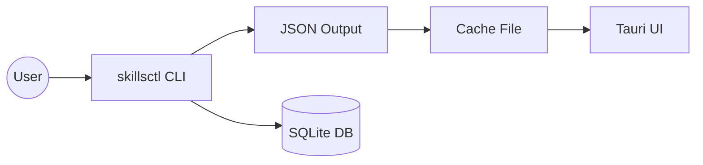

# ADR 0001: CLI-First Architecture

**Status:** Accepted
**Date:** 2026-01-27
**Decision:** Implement SkillsInspector v1 with a CLI-first architecture where validation logic lives exclusively in the CLI, and the Tauri UI shell only renders CLI JSON output.
**Authors:** Jamie Craik

## Context

SkillsInspector v1 needs to modernize from a Swift-based app to a React-Tauri implementation while preserving CLI compatibility and validation correctness. The primary risk is divergence between UI and CLI validation logic, which could lead to inconsistent results.

## Decision

**CLI-First Architecture:**
- All validation rules and scan/fix/sync-check logic live in the Node.js CLI (`packages/cli`)
- The Tauri UI is a thin shell that:
  - Invokes CLI commands via IPC
  - Renders CLI JSON output
  - Never computes findings independently
- JSON output is the single source of truth for both CLI and UI

### Architecture Diagram

## Rationale

1. **Avoid Logic Duplication:** If UI and CLI both implement validation, they will inevitably drift apart over time.
2. **Preserve CLI Contracts:** CI workflows and scripts depend on stable CLI outputs and exit codes.
3. **Simpler Testing:** Validation logic only needs unit tests in one place (the CLI).
4. **Clear Separation of Concerns:** CLI owns correctness; UI owns presentation.

## Alternatives Considered

### Alternative 1: Full UI Parity in v1
**Description:** Implement all validation logic in TypeScript and have both CLI and UI call the same core library.

**Pros:**
- Shared codebase
- Richer UI features possible

**Cons:**
- More complex to maintain
- Risk of UI-specific logic creeping into "core"
- CLI becomes secondary citizen
- Larger initial implementation scope

**Rejected because:** Scope creep and higher maintenance burden. The v1 goal is CLI parity with minimal UI.

### Alternative 2: Rust-First Core
**Description:** Implement validation logic in Rust, with CLI and UI both calling the same Rust library via FFI.

**Pros:**
- Single codebase
- Native performance

**Cons:**
- More complex build pipeline
- FFI boundary adds friction
- Rust learning curve for maintainers
- JSON output still needs careful parity testing

**Rejected because:** Node.js/TypeScript is the team's primary stack, and Rust adds unnecessary complexity for v1.

## Tradeoffs

### What We Gain
- Single source of truth for validation
- Simpler testing surface
- Faster time to MVP
- Easier rollback if UI has issues

### What We Give Up
- UI cannot perform any validation without spawning CLI
- No "live" validation as user types (would require long-running CLI processes)
- Fix actions in UI are deferred to v1 (CLI-only in v1)

## Implementation Notes

- UI commands (`run_scan`, `run_sync_check`) spawn the bundled `skillsctl` binary
- CLI writes JSON to stdout; UI parses and caches the result
- Exit codes and stderr are preserved for error handling
- Cache directory is app-scoped (Tauri app data dir)

## Consequences

### Positive
- CI users get stable, deterministic CLI outputs
- Validation bugs only need to be fixed in one place
- UI can focus on presentation and accessibility

### Negative
- UI features that require direct access to validation logic are deferred to post-v1
- UI performance depends on CLI execution time
- No "real-time" validation feedback in the UI

## Related Decisions

- See [ADR 0002: Scope v1 Minimal UI](./0002-scope-v1-minimal-ui.md) for what's included in v1
- See [ADR 0003: UI JSON-Only](./0003-ui-json-only.md) for UI implementation details

## References

- Foundation Spec: `.spec/foundation-2026-01-25-skillsinspector-react-tauri-v1.md`
- Build Plan: `.spec/build-plan-2026-01-25-skillsinspector-react-tauri-v1.md`
- Tech Spec: `.spec/tech-spec-2026-01-26-skillsinspector-react-tauri-v1.md`
